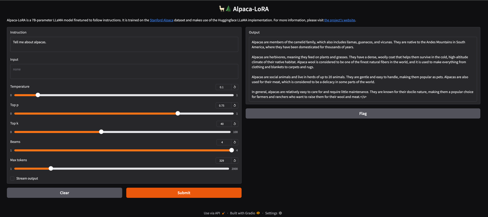
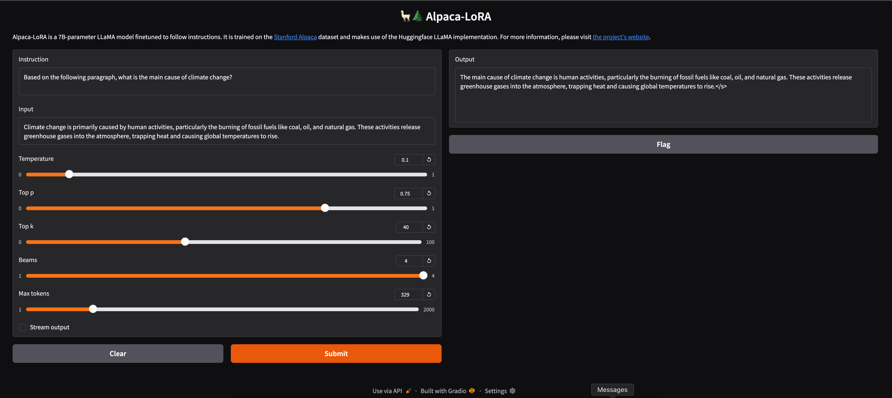
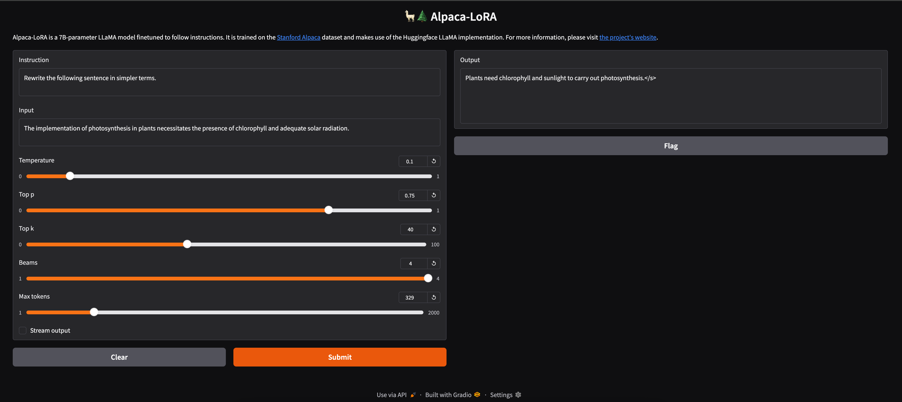

# 🦙 Alpaca-LoRA on OpenLLaMA-7B (Hyak Reproduction)

Reproducing instruction-tuned LoRA fine-tuning and inference for OpenLLaMA-7B on the UW Hyak cluster, with systematic debugging of decoding, faithfulness, and deployment issues.

Please refer to the original [Alpaca-lora](!https://github.com/tloen/alpaca-lora) project if you need any information from the original project.

## 1. Project Overview

This project reproduces the alpaca-lora instruction fine-tuning pipeline on OpenLLaMA-7B, running entirely on the UW Hyak GPU cluster.

Key goals of this project:

	•	Reproduce LoRA fine-tuning on a large language model. Record the whole training process by WanDB.
	•	Deploy inference via Gradio on a GPU node and access it locally via SSH port forwarding
	•	Diagnose and fix common inference and decoding pitfalls
	•	Evaluate instruction-following improvements with lightweight, targeted examples
    •	This is my first end-to-end LLM fine-tuning & inference project, focusing on correctness, reproducibility, and engineering understanding rather than large-scale benchmarks.

Base model: OpenLLaMA-7B
Fine-tuning: LoRA (alpaca-lora)
Hardware: NVIDIA L40 (Hyak)

## 2. Repository Structure

This repo keeps only **code + configs + scripts** under version control.  
All **training outputs / checkpoints / logs** are generated at runtime and are **ignored by git**.

```text
alpaca-lora/
├── finetune.py                      # LoRA fine-tuning entry
├── generate.py                      # Gradio inference server
├── export_hf_checkpoint.py           # export to HF-style checkpoint
├── export_state_dict_checkpoint.py   # export adapter/state_dict
│
├── instr_tuning_alpaca_lora_7b.sbatch # the script to run training on Hyak
│
├── requirements.txt                  # Python deps
├── pyproject.toml                    # packaging / tooling (upstream)
├── README.md
├── LICENSE
├── DATA_LICENSE
│
├── utils/                            # prompt / callbacks / helpers (upstream)
├── templates/                        # prompt templates (upstream)
└── .github/                          # CI / templates (upstream)

# Runtime artifacts (NOT tracked in git)
├── logs/                             # slurm logs (ignored)
└── out/                              # checkpoints / runs (ignored)
    └── instr-alpaca-lora-7b/...
└── sbatch/                              # This is where sbatch file is in my Hyak working directory
    └── instr_tuning_alpaca_lora_7b.sbatch 
```

> Note: On Hyak I keep a workspace directory (e.g. `alpaca-lora-run/`) that contains this repo plus runtime folders like `out/` and `logs/`. Only the repo itself is pushed to GitHub.

## 3. Training Configuration and Monitoring

### Compute (Hyak)
- Cluster: UW Hyak
- GPU: 1 × NVIDIA L40 (`--partition=gpu-l40`, `--gres=gpu:1`)
- CPU: 4 (`--cpus-per-task=4`)
- Memory: 48G (`--mem=48G`)
- Time limit: 8h (`--time=08:00:00`) (In fact around two hours)

### Base Model & Dataset
- Base model: `openlm-research/open_llama_7b_v2`
- Dataset: `yahma/alpaca-cleaned`
- Validation set size: `200`
- Context length (cutoff): `256`

### Optimization & Batch
- Epochs: `1`
- Learning rate: `3e-4`
- Micro batch size: `4`
- Global batch size: `32`
- `group_by_length`: enabled (more efficient batching)

### LoRA Hyperparameters
- LoRA rank (r): `8`
- LoRA alpha: `16`
- LoRA dropout: `0.05`

### Logging
- Weights & Biases:
  - project: `instr-alpaca-lora-7b`
  - run name: `instr-alpaca-lora-7b_<SLURM_JOB_ID>`

### Cluster-specific Notes (Hyak)
- Hugging Face caches were redirected to scratch to avoid filling home quota:
  - `HF_HOME=/gscratch/.../.cache/huggingface`
  - `TRANSFORMERS_CACHE`, `HF_DATASETS_CACHE`
- W&B cache directory:
  - `WANDB_DIR=/gscratch/.../.cache/wandb`
- CUDA allocator tweak to reduce fragmentation:
  - `PYTORCH_CUDA_ALLOC_CONF=expandable_segments:True`

Please refer to my [sbacth file](!./instr_tuning_alpaca_lora_7b.sbatch) to see more details.

Please refer to  [WanDB](!https://wandb.ai/yan-sir/instr-alpaca-lora-7b?nw=nwuserjieyao99) to see my latest training process.

Please refer to [my lora adapter page](!https://huggingface.co/JieYao24/alpaca-lora-openllama-7b-hyak) for the information of my training result. The latest training day is Feb 9, 2026.

## 4. Deployment

Using this to deploy:  
python generate.py \
  --base_model openlm-research/open_llama_7b \
  --lora_weights path/to/checkpoint

If you want to use my lora adapter weights:  
python generate.py \
  --base_model openlm-research/open_llama_7b_v2 \
  --lora_weights jieyao24/alpaca-lora-openllama-7b-hyak

The latest training day is Feb 9, 2026.

## 5. Inference Configuration

Two decoding modes were used:

Evaluation mode: 
```
temperature: 0
top_p: 1
top_k: 0
num_beams: 1
do_sample: false
```
Rationale:
Deterministic decoding significantly improves faithfulness and constraint adherence.

Interactive mode:
```
temperature: 0.3
top_p: 0.75
top_k: 40
num_beams: 1
```

However, without eval dataset, I cannot make further research on the best configurations of differet modes.

## 6. Demo

Here some demo screenshots:




## 7. Key Takeaways

•	LoRA significantly improves instruction following on OpenLLaMA-7B.  
•	Decoding strategy has a large impact on faithfulness    
•	Engineering details (prompt wiring, EOS handling, decoding) matter as much as training  
•	Lightweight qualitative evaluation is sufficient for early-stage projects  

## 8. Future Work
•	Quantitative benchmark evaluation (e.g., MT-Bench / IFEval)  
•	Compare LoRA ranks and checkpoints  
•	Multi-GPU or longer-context experiments  

## 8. Acknowledgements

This project is based on the original alpaca-lora repository by tloen and contributors.
All credit for the original method and dataset goes to the original authors.

This work was/were completed on Hyak, UW’s high performance computing cluster. This resource was funded by the UW student technology fee. See more about Hyak and RCC: [link](!https://depts.washington.edu/uwrcc/)